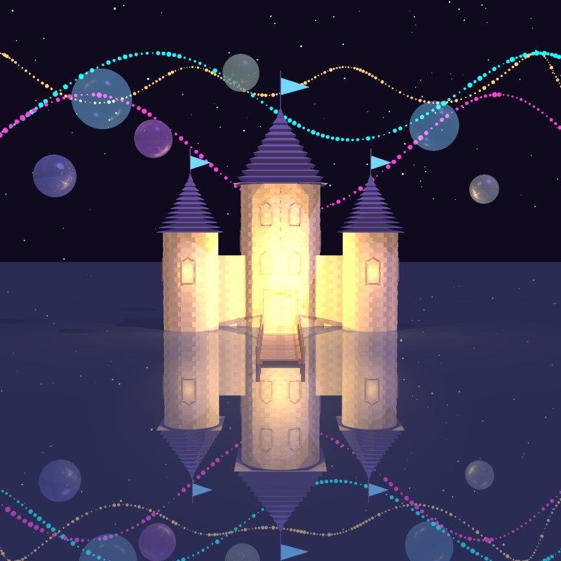
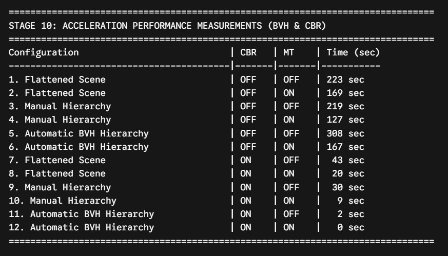
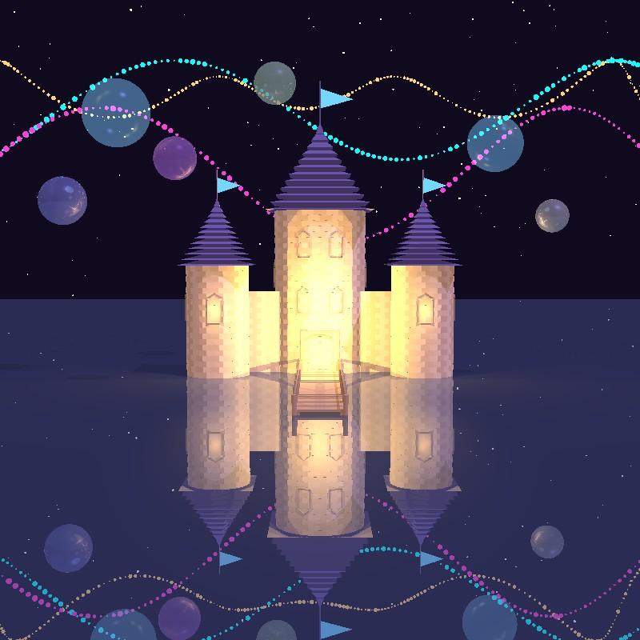
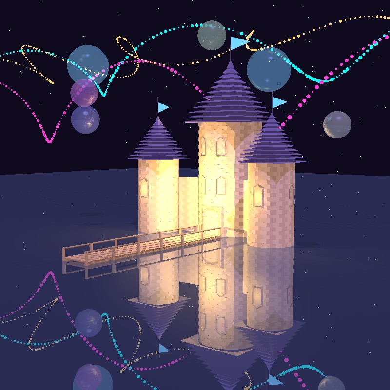
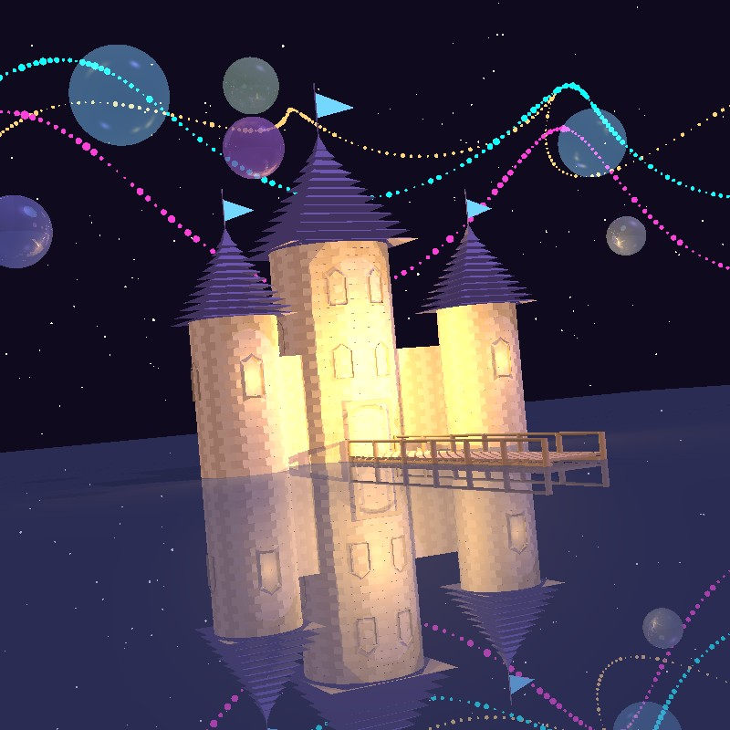

# 🏰 Magic Castle 3D Rendering Engine

> A highly optimized, custom 3D rendering engine built in IntelliJ, featuring a magical castle scene with dynamic skies,
> water reflections, and advanced visual effects.

<p align="center">
  
</p>

<p align="center">
  
  
  
</p>

---

## 📌 Table of Contents

- [About the Project](#-about-the-project)
- [Key Features & Optimizations](#-key-features--optimizations)
- [Performance Metrics](#-performance-metrics)
- [Before & After Gallery](#-before--after-gallery)
- [Tech Stack](#-tech-stack)
- [Getting Started](#-getting-started)
- [Contributing](#-contributing)
- [License](#-license)

---

## 🔍 About the Project

This project was developed to create a realistic and computationally efficient 3D rendering environment from scratch.
The primary focus was on applying advanced software engineering principles and computer graphics algorithms to build a
visually stunning scene. The centerpiece is a meticulously designed magical castle, complete with brick towers,
symmetrical windows, a wooden bridge, and an atmospheric dynamic sky.

Throughout the development process, significant architectural changes were made to overcome rendering bottlenecks,
resulting in a smooth, high-fidelity graphical output.

---

## ⚡ Key Features & Optimizations

To achieve the final visual quality while maintaining high performance, several advanced algorithms and rendering
techniques were implemented:

* **Bounding Volume Hierarchy (BVH):** Implemented advanced data structures to drastically reduce intersection
  calculation times.
* **Geometry Optimization:** Transitioned from heavy, complex polygon meshes to mathematically efficient spheres without
  sacrificing visual aesthetics.
* **Multi-Threading (MT):** Distributed rendering workloads across multiple CPU threads to maximize hardware utilization
  and reduce rendering time.
* **Camera Bounding Region (CBR):** Optimized camera ray generation to only process necessary scene segments.
* **Adaptive Super-Sampling:** Applied intelligent anti-aliasing techniques to smooth out jagged edges, ensuring crisp
  and clean visuals.
* **Depth of Field (DoF):** Added cinematic focus effects to simulate real-world camera lenses.
* **Rich Visual Effects:** Integrated a custom particle system for floating magical bubbles, realistic water
  reflections, and dynamic lighting.

---

## 📊 Performance Metrics

To prove the effectiveness of the implemented data structures (BVH), Multi-Threading (MT), and Camera Bounding Regions (
CBR), here are the actual recorded rendering times during the optimization phases.
As shown, the engine's optimizations reduced the rendering time of the complex scene from over **3 minutes (223s)** down
to **less than a second (0s)**!

<p align="center">
  
</p>

---

## 🖼️ Before & After Gallery

The following comparison highlights the dramatic improvements in lighting, reflections, geometry, and overall rendering
quality achieved during the optimization phases:

|     Camera Angle      |                       Basic Engine (Before)                        |                     Optimized Engine (After)                     |
|:---------------------:|:------------------------------------------------------------------:|:----------------------------------------------------------------:|
|    **Front View**     |       |       |
| **Right Perspective** |       |       |
|  **Low Tilt Angle**   |  |  |

---

## 🛠 Tech Stack

* **IDE:** IntelliJ IDEA
* **Core Languages:** Java
* **Version Control:** Git & GitHub

---

## ⚙️ Getting Started

Follow these steps to run the Magic Castle 3D engine on your local machine:

1. **Clone the Repository:**
   ```bash
   git clone https://github.com/MiriYaakobi/MagicCastle3D.git
   ```

2. **Open in IDE:**
    * Launch `IntelliJ IDEA`.
    * Click on `Open` and select the cloned project directory.

3. **Configuration:**
    * Ensure your Project SDK is correctly configured via `File -> Project Structure`.
    * Allow the IDE to index the project and load any necessary dependencies.

4. **Run the Engine:**
    * Navigate to the `Main` class.
    * Run the application (`Shift + F10`) to initiate the rendering process.

---

## 🤝 Contributing

Contributions, issues, and feature requests are welcome!
If you have suggestions to further optimize the rendering pipeline:

1. Fork the project.
2. Create your feature branch (`git checkout -b feature/AmazingOptimization`).
3. Commit your changes (`git commit -m 'Add some AmazingOptimization'`).
4. Push to the branch (`git push origin feature/AmazingOptimization`).
5. Open a Pull Request.

---

## 📄 License

This project is licensed under the MIT License. See the [LICENSE](LICENSE) file for more details.